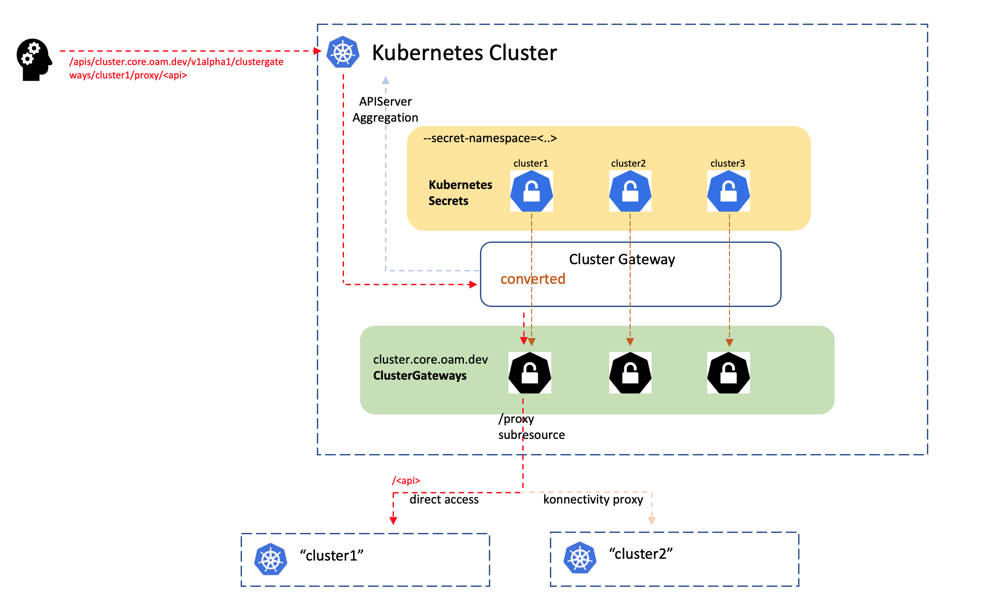

# Cluster Gateway

## Overall

"Cluster Gateway" is a gateway apiserver for routing kubernetes api traffic
to multiple kubernetes clusters. Additionally, the gateway is completely 
pluggable for a running kubernetes cluster natively because it is developed
based on the native api extensibility named [apiserver-aggregation](https://kubernetes.io/docs/concepts/extend-kubernetes/api-extension/apiserver-aggregation/).
A new extended resource "cluster.core.oam.dev/ClusterGateway" will be 
registered into the hosting cluster after properly applying corresponding 
`APIService` objects, and a new subresource named "proxy" will be available 
for every existing "Cluster Gateway" resource which is inspired by the 
original kubernetes "service/proxy", "pod/proxy" subresource.

Overall our "Cluster Gateway" also has the following merits as a multi-cluster 
api-gateway solution:

- __Etcd Free__: Normally an aggregated apiserver must be deployed along 
  with a dedicated etcd cluster which is bringing extra costs for the admins. 
  While our "Cluster Gateway" can be running completely without etcd instances,
  because the extended "ClusterGateway" resource are virtual read-only 
  kubernetes resource which is converted from secret resources from a namespace
  in the hosting cluster.
  
- __Scalability__: Our "Cluster Gateway" can scale out to arbitrary instances
  to deal with the increasing loads 
  



## Image

```shell
$ docker pull oamdev/cluster-gateway:v1.1.8 # Or other newer tags
```

## Documentation

- __Run Local__: https://github.com/oam-dev/cluster-gateway/blob/master/docs/non-etcd-apiserver/local-run.md

### Performance

Compile the e2e benchmark suite by:

```shell
$ make e2e-benchmark-binary
```

The benchmark suite will be creating-updating-deleting configmaps in a flow
repeatly for 100 times. Here's a comparison of the performance we observed
in a local experiment:


|  Bandwidth  |  Direct          |  ClusterGateway  | ClusterGateway(over Konnectivity) |
|-------------|------------------|------------------|-----------------------------------|
|  Fastest    |  0.083s          |  0.560s          | 0.556s                            |
|  Slowest    |  1.078s          |  1.887s          | 2.579s                            |
|  Average    |  0.580s ± 0.175s |  0.849s ± 0.361s | 1.408s ± 0.542s                   |

### Open-Cluster-Management Integration

Cluster-gateway has native integration with [Open-Cluster-Management(OCM)](https://open-cluster-management.io/)
to provide the KubeVela admin a more coherent user experience in distributing
applications across multiple clusters:

#### Enabling OCM seamlessly in your KubeVela environment

The official vela addon named [ocm-cluster-manager](https://github.com/oam-dev/catalog/tree/master/addons/ocm-cluster-manager)
will help you easily bootstrap the OCM control plane (in the hosting cluster
where your KubeVela control plane lives). Note that the OCM environment 
installed from the addon above will not take any effect until we opt-in to
enable the functional integration between KubeVela and OCM as is elaborated 
below. It's just a minimal trial setup to try out OCM instantly, while in order
to enable the further integration with OCM, we will need to adjust the 
configuration of cluster-gateway to make it detect and aware of the local OCM
environment.

#### Aligning ClusterGateway to OCM's cluster registry

By opt-in to the flag `--ocm-integration=true`, the cluster-gateway will be
detecting and loading the OCM environment in the hosting cluster and connecting
each `ClusterGateway` custom resource from cluster-gateway to OCM's original
cluster model in OCM named `ManagedCluster`. The `ClusterGateway` is a
gateway "ingress" abstraction for the Kubernetes clusters managed by KubeVela,
so after integrating with OCM it's intuitive to regard the gateway resource
as a "satellite" child resource around `ManagedCluster`. Setting the flag will
make the cluster-gateway filter out those dangling `ClusterGateway` that doesn't
have a valid `ManagedCluster` bound with. In addition to that, we won't need to
explicitly set the master URL in the cluster secret because the cluster-gateway
will be merging the URL list from the corresponding `ManagedCluster`. 

Furthermore, by enabling the integration, we will also reflect/aggregate the 
healthiness of the corresponding clusters by partially merging the original
healthiness status from OCM's `ManagedCluster`. So we can save the troubles 
before attempting to talk to an unavailable cluster.

#### Delegating the upgrading/rotation of cluster-gateway to OCM

Installing the cluster-gateway via the [standalone chart](https://github.com/oam-dev/cluster-gateway/tree/master/charts/cluster-gateway)
or [KubeVela's chart](https://github.com/oam-dev/kubevela/tree/master/charts/vela-core)
provides us a one-time light-weighting setup of cluster-gateway, but sadly 
there are still some missing puzzles we should notice before we bring the 
cluster-gateway into sustainable production environment:

- The rotation of cluster-gateway's server TLS certificate.
- Automatic addition/removal of the `ClusterGateway` resource upon cluster 
  discovery.

In order to fill the blanks in cluster-gateway above, optionally we can delegate
the management of cluster-gateway to OCM by introducing a new component named [cluster-gateway-addon-manager](https://github.com/oam-dev/cluster-gateway/tree/master/cmd/addon-manager)
to the hosting cluster which is basically responsible for:

1. Sustainable installation as a typical "operator" dedicated for
   cluster-gateway.
2. Modelling cluster-gateway as an [OCM addon](https://open-cluster-management.io/concepts/addon/).

The addon-manager can be installed via simple helm commands, please refer to
the installation guide [here](https://open-cluster-management.io/scenarios/pushing-kube-api-requests/#installation).
